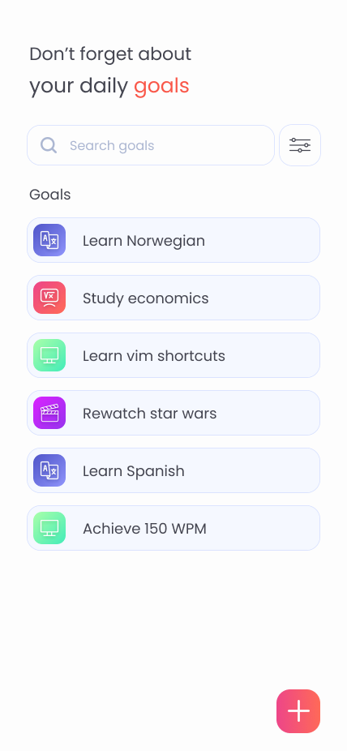
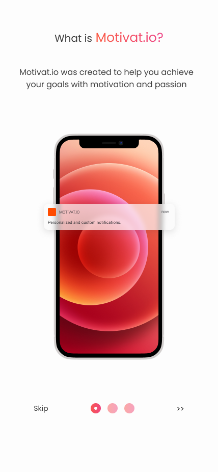

# Motivat.io

The app is created for people who struggle with finding their motivation to achieve certain goals and/or keep forgetting about practicing new skills.

|   |  
-----------------------------------------------|----------------------------------------

## Tech Stack
Main technologies used in the project:
- Typescript
- React Native
- React Native CLI
- Redux toolkit

## Local deployment 
*yarn is author's package manager of choice, but npm works just fine too*

- Installing dependencies: ```yarn install``` or ```npm install```
- Running the project: ```yarn install``` or ```npm start```

## Roadmap (kinda)
- Implement basic todo-like functionality
- Create a goal sharing system
- Create a public goal ranking system

### Extended goal explanation
Lately I've been struggling with doing almost anything, even most basic things like leaving my bed, forcing myself to eat and such. What usually would help me deal with that feeling was overworking myself (call it whatever you want, but basically giving myself so much job that I would simply not have the time to think about bad things), but at some point it just didn't help anymore and I felt absolutely burnt out. I wouldn't talk about this so openly, but I really wanna help people like me who are just unlucky to not have the time of their life at the moment, and that's exactly why I decided to create "Motivat.io". The app is focused towards constatly reminding people to do things that they've always wanted to do, like learning a new language or studying advanced algebra, but who always forget to or simply can't make themselves do so